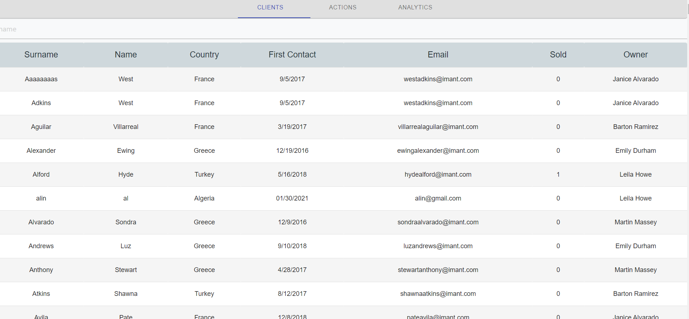
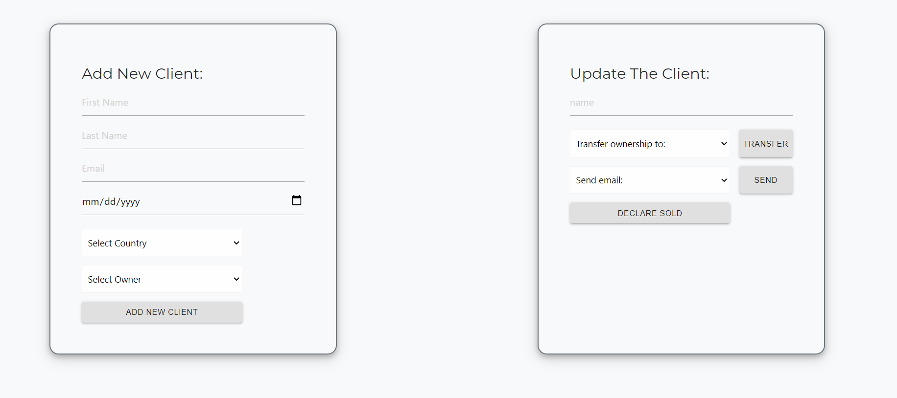
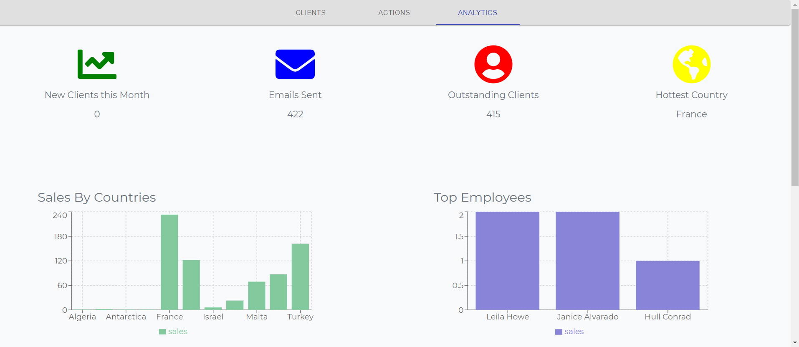
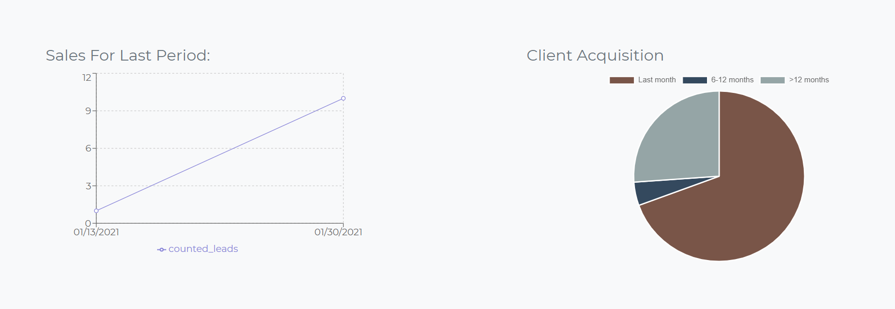

Client Management System with a graphics analytics dashboard

Technologies: 
              Frontend:
            React, React Hooks, Mobx, react-router-dom, react-chartjs-2, recharts, Material UI, fontawesome.
               Backend:
            Express, mySQL, sequelize.

Project ScreenShots:

  Home page renders the clients list from Data Base and dynamic input for searching for specific client:

  

  Action page renders two inputs containers for addindg/updating the clients:

  

  Analytics page renders badges and charts with the useful and updated data
  in the accessible and clear form:

  
  

# Getting Started:

Clone this repository. You will need node, npm and MySQL installed globally on your machine.
run npm install
Database setup:
run CREATE DATABASE sql_crm in sql file
run node server to create all DB tables
run npm start in another terminal

